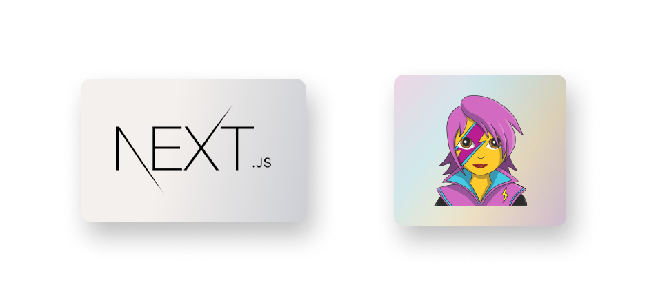

This is a [Next.js](https://nextjs.org/) blog project bootstrapped with [`create-next-app`](https://github.com/vercel/next.js/tree/canary/packages/create-next-app) and styled with [Emotion](https://emotion.sh/docs/styled)

## Getting Started

First, run the development server:

```bash
npm run dev
```
or
```
yarn dev
```

Open [http://localhost:3000](http://localhost:3000) with your browser to see the result.

## Used in this project

 - [Next.js](https://nextjs.org/)
 - [Emotion](https://emotion.sh/docs/styled)